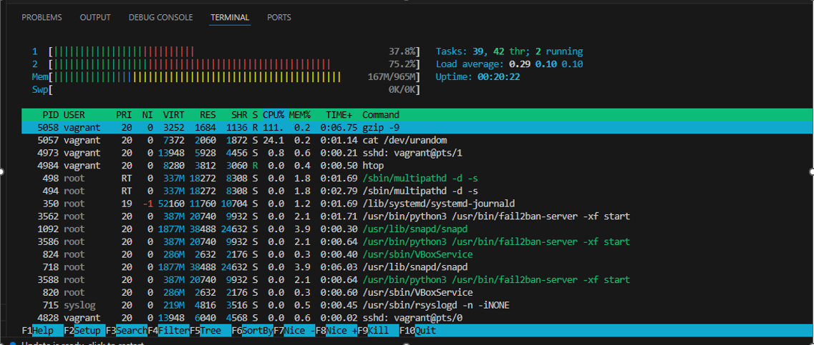
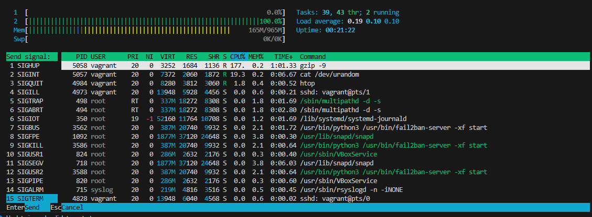
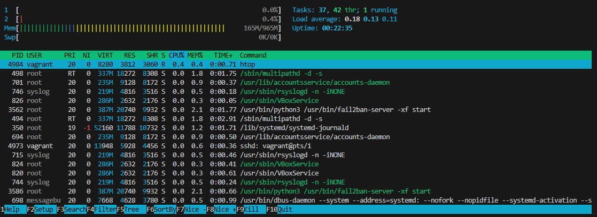

# Sesión 06: Monitorización y Procesos

## A) El Infarto Controlado (Estrés de CPU)
+ Queremos ver cómo reacciona el monitor cuando el servidor está al límite.
1. Abre htop en tu terminal.  
2. Abre otra pestaña de terminal (u otra conexión SSH) y lanza este "monstruo":
```
cat /dev/urandom | gzip -9 > /dev/null &
(Este comando lee datos infinitos, los comprime al máximo y los tira a la basura, consumiendo toda la CPU que pueda).
```  

## B) Análisis en htop
+ Vuelve a la pantalla de htop y observa:
1. ¿De qué color se han puesto las barras de la CPU? (Suelen ser verde/rojo).
2. ¿Cuál es el Load Average? Mira si el primer número empieza a subir de 0.50 o 1.00.
3. Identifica el culpable: El proceso gzip debería estar arriba del todo.
  

## C) La Intervención (Matar el proceso)
+ Un buen administrador no reinicia el servidor, elimina al culpable. 
+ En htop, usa las flechas para iluminar la línea de gzip.
1. Pulsa la tecla F9 (Kill).
2. Te preguntará qué "Señal" enviar. Elige la 15 (SIGTERM) (es la forma educada de cerrar) o la 9 (SIGKILL) (si no responde).
3. Pulsa Enter.
  
+ ¿Ves cómo la CPU vuelve a la calma instantáneamente?
  

### EXPLICACIONES:
```
¿Qué es el Proceso gzip?
En nuestro ejercicio, simuló una tarea pesada (compresión de datos aleatorios). Es el equivalente a un proceso que se queda "colgado" en un servidor real (como un script de PHP mal programado o una base de datos haciendo un cálculo infinito).
```
```
La técnica del "Kill" (F9 en htop):
SIGTERM (15): Es un "Por favor, cierra cuando puedas". El proceso guarda lo que está haciendo y se apaga de forma limpia.
SIGKILL (9): Es un "¡Muere ahora!". Se usa cuando el proceso no responde a nada. Es drástico pero efectivo.
```
```
Los 3 números del Load Average:
Representan la media de procesos esperando CPU en los últimos 1, 5 y 15 minutos.
Metáfora: Es como la cola de un supermercado. Si hay 1 cajera (1 CPU) y el Load es 2.0, hay una persona pagando y otra esperando. Si el Load es 0.5, la cajera está mano sobre mano la mitad del tiempo.
```
```
Colores de la barra de RAM:
Verde: Memoria que no puedes tocar (está en uso real).
Azul/Amarillo: Memoria que Linux usa para "caché". No cuenta como "llena" porque Linux la vacía al instante si un programa la necesita.
```

### BUENAS PRÁCTICAS
+ Cuando el servidor está en "estado vegetativo" (CPU al 100% real o Disco lleno), tienes tres niveles de actuación, de más profesional a más "bruto":

1. Qué hacer: Intenta entrar y, en cuanto veas el cursor, no escribas htop (que consume RAM y CPU para cargar los colores). Escribe directamente el comando de "muerte" a ciegas: sudo killall -9 `gzip/nombre_proceso`  

2. El Panel de Control Externo (Fuera de la Red). En el mundo real (AWS, Google Cloud, Azure), los servidores tienen una "Consola de Serie" o "KVM".  
- Qué es: Es como conectar un monitor y un teclado directamente a la torre del servidor, saltándote la tarjeta de red.  
- Por qué funciona: Porque no usa el protocolo SSH. Es una conexión física (o emulada) que suele responder aunque la red esté saturada.  

3. El Botonazo (Hard Reset) - En tu caso: Vagrant. Si nada de lo anterior funciona, el servidor ha entrado en un Kernel Panic o un bloqueo total. Aquí es donde entra la magia de la virtualización que estamos usando.
Desde tu PowerShell de Windows (fuera de la máquina), tienes el poder de "desenchufar" el cable:
- vagrant halt: Envía una señal de apagado. Si el servidor está muy colgado, puede que no responda.  
- vagrant reload --force: Este es el comando "mágico". Reinicia la máquina virtual a la fuerza y vuelve a cargar la configuración.  
- VirtualBox: Si Vagrant se queda pillado, abres la interfaz de VirtualBox, click derecho en la máquina -> Cerrar -> Apagado desactivado (es como quitar la batería al portátil).